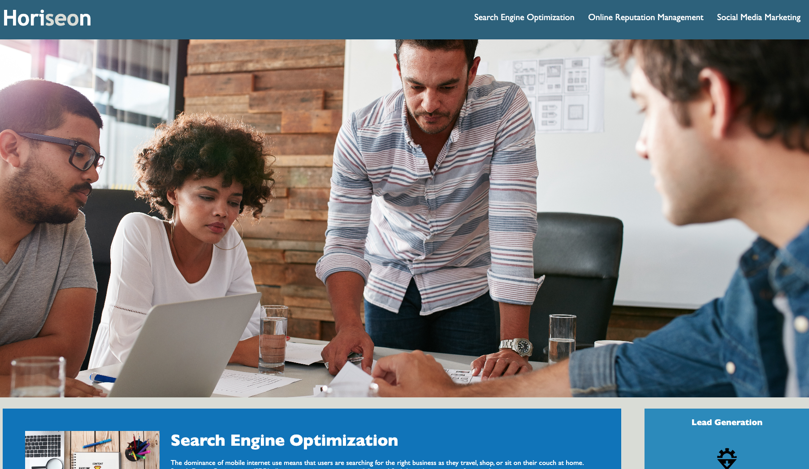

<!-- PROJECT LOGO -->
 

  

<h3 align="center">M1 Challenge</h3>

  

   A Refactoring of CSS and HTML to follow semantic standards. 
     
     
    <a href="https://conradjohnson.github.io/m1-challenge">View Demo</a>
    ·
    <a href="https://github.com/conradjohnson/m1-challenge/issues">Report Bug</a>
    ·
    <a href="https://github.com/conradjohnson/m1-challenge/issues">Request Feature</a>
       
    Screen Grab 1: 
    
     
    
(<a href="#top">back to top</a>)

   
  

